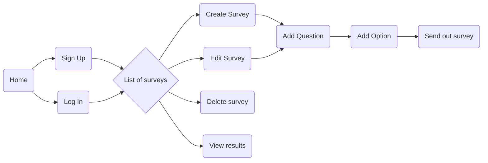
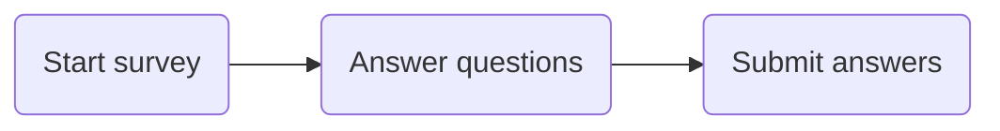

# Django Survey App

A survey app where users can create surveys and send them out to other people.
When the survey is complete, the survey's creator can see what percentage of people answered each question.
Written in Django. Hosted at Heroku : [Click here to test Django Survey App.](https://limitless-retreat-14624.herokuapp.com/)

# User journeys

**Survey creator user journey:**

**Survey taker user journey:**

